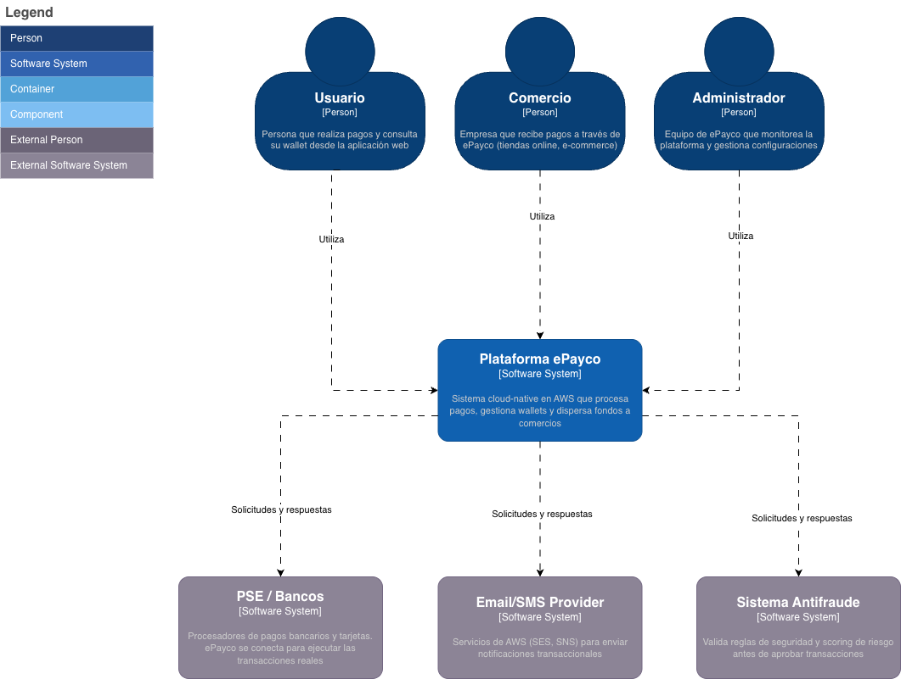

# C1 - Contexto del Sistema

Diagrama de contexto mostrando cómo la plataforma ePayco interactúa con usuarios y sistemas externos.

## Responsabilidades de la Plataforma

Lo que hace ePayco:
- Procesar transacciones de forma segura
- Gestionar wallets y saldos de usuarios
- Orquestar pagos con consistencia (SAGA pattern)
- Dispersar pagos a comercios
- Auditar todas las operaciones
- Notificar a usuarios y comercios

Lo que NO hace (delega):
- Procesamiento bancario real → PSE/Bancos
- Envío físico de emails/SMS → AWS SES/SNS  
- Scoring complejo de fraude → Sistema especializado

## Stack Técnico

Backend: NestJS microservicios en ECS Fargate  
Frontend: NextJS (SSR/SSG)  
DB: Aurora PostgreSQL + DynamoDB  
Orquestación: AWS Step Functions  
Observabilidad: CloudWatch + X-Ray
