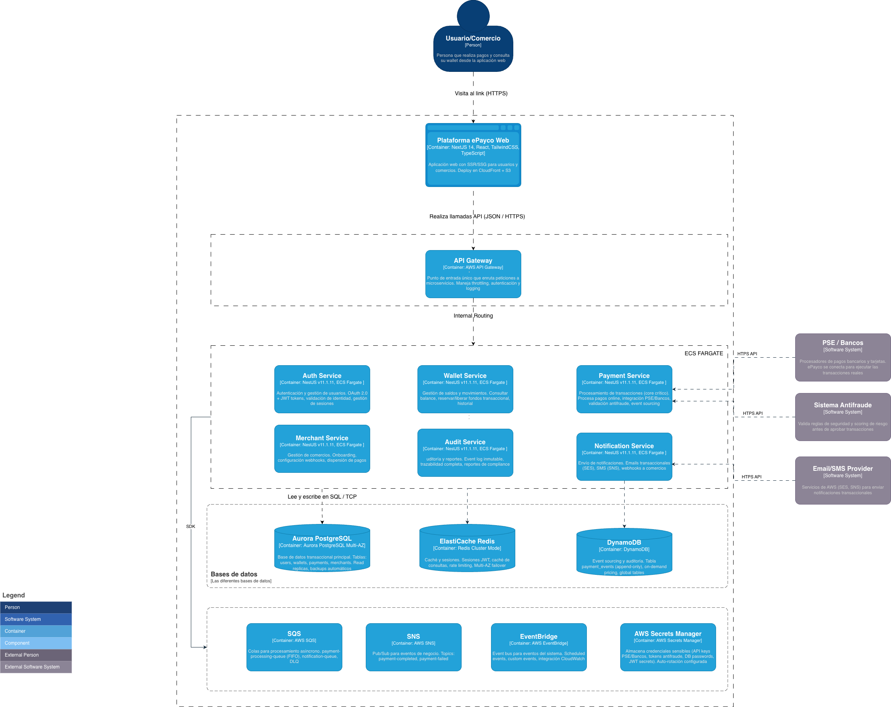

# C2 - Contenedores del Sistema

Diagrama mostrando los contenedores (aplicaciones, microservicios, bases de datos) dentro de la plataforma ePayco y cómo se comunican.

**FLUJO PRINCIPAL:**
1. Usuario → NextJS → API Gateway → Microservices
2. Payment Service → Step Functions (inicia SAGA)
3. Step Functions → Wallet (reserva) → Payment (procesa) → Notification
4. Todos los services → Aurora (transaccional)
5. Payment → DynamoDB (event sourcing)
6. SNS → Notification + Audit (eventos async)
7. Payment → PSE/Bancos (procesamiento real)
8. Payment → Antifraude (validación)
9. Notification → SES/SNS (envío emails/SMS)

## Comunicación con Lambdas

Step Functions invoca Lambdas para compensaciones SAGA cuando algo falla (ej: liberar fondos si el banco rechaza el pago). EventBridge triggerea Lambdas con rules programadas para batch jobs: dispersión diaria a las 00:00, reportes semanales, limpieza de datos. También hay Lambdas que consumen de SQS dead-letter queues para reprocesar mensajes que fallaron.

Las Lambdas llaman a microservicios vía REST. Lambda de dispersión → Merchant Service (webhooks a comercios). Lambda de batch → Notification Service (resúmenes diarios). Lambda de compensación → Wallet Service (liberar fondos).

## Comunicación con Mensajería

**SQS** - Payment, Wallet y Merchant publican a colas FIFO cuando procesan operaciones. Notification y Audit consumen de estas colas haciendo polling. Procesamiento async desacoplado.

**SNS** - Payment publica eventos (PaymentCreated, PaymentCompleted) a payment-events. Notification y Audit están suscritos y reciben push. Wallet publica a wallet-events (BalanceUpdated, FundsReserved). Merchant publica a merchant-events (MerchantRegistered, DispersionCompleted). Patrón pub/sub clásico.

**EventBridge** - Microservicios publican eventos custom con PutEvents (PaymentProcessingStarted, LowBalanceAlert, WebhookFailed). EventBridge triggerea Lambdas con rules o inicia workflows de Step Functions. Útil para eventos programados y orquestación de eventos.

## Secrets Manager

Todos los contenedores obtienen credenciales de Secrets Manager con GetSecretValue. Payment obtiene API keys de PSE/Bancos y token antifraude. Notification obtiene credenciales SES y API keys SMS. Auth obtiene JWT signing key. Todos obtienen passwords de Aurora y Redis. Las Lambdas también lo usan para conectarse a APIs externas. Auto-rotación activada.
