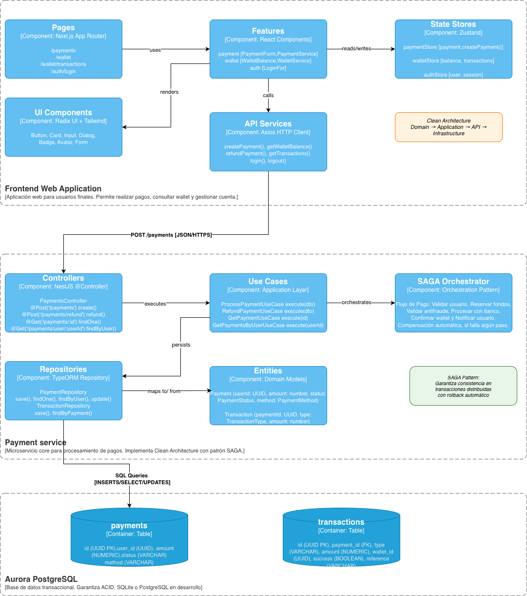

# C3 - Componentes del Sistema

Diagrama de nivel 3 mostrando los componentes internos de los contenedores principales (Frontend Web App y Payment Service) según el modelo C4.

---

## Descripción

Este diagrama detalla la estructura interna del Payment Service como referencia de la arquitectura implementada. Los demás microservicios del sistema (User, Wallet, Notification, Transaction) seguirán la misma organización por capas: API, Application, Domain e Infrastructure. Esto mantiene consistencia en el código y facilita el mantenimiento a futuro.

---
