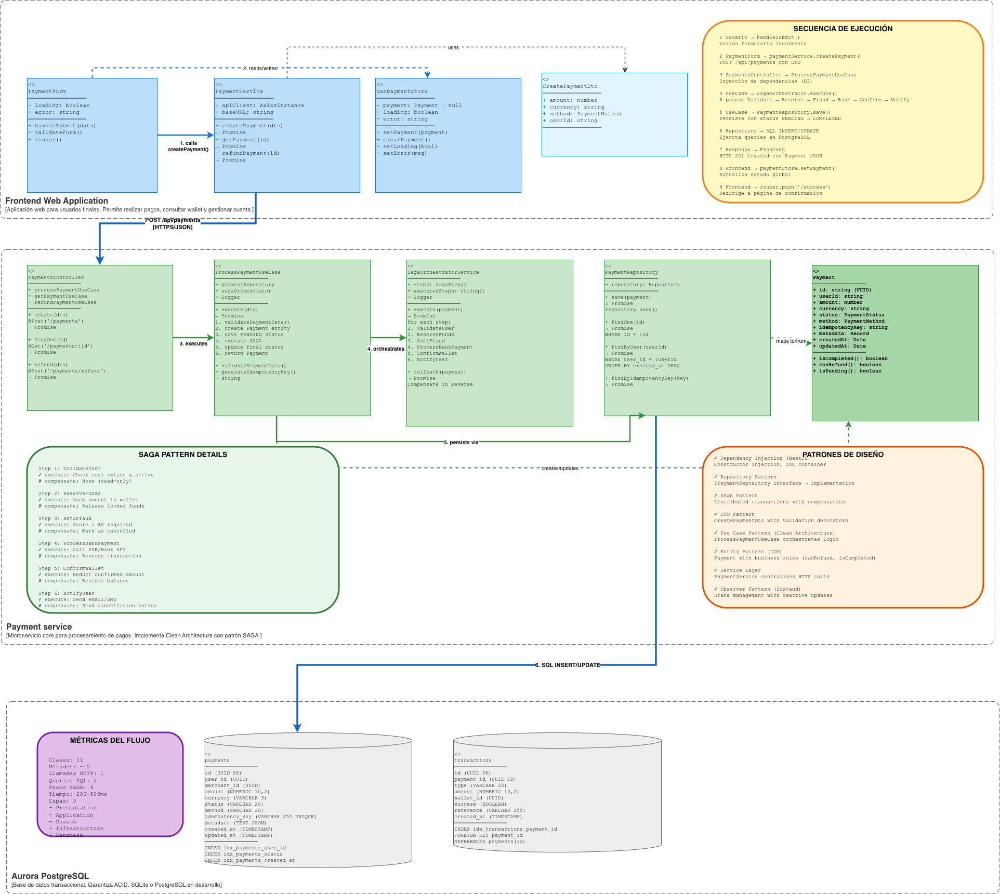

# C4 - Code (Diagrama de Código)

Diagrama de nivel 4 mostrando los detalles de implementación a nivel de código para el **flujo de Procesamiento de Pago**, el flujo más crítico del sistema.

---

## Descripción

Este diagrama profundiza en el código del flujo de pago, mostrando las clases, métodos e interfaces involucradas desde que el usuario presiona "Pagar" hasta recibir la confirmación. Se eligió este flujo porque representa bien toda la arquitectura: frontend React comunicándose con backend NestJS, pasando por los use cases, el orquestador SAGA, y finalmente persistiendo en base de datos. El código mostrado es funcional y sirve como guía de implementación para otros flujos del sistema.

---