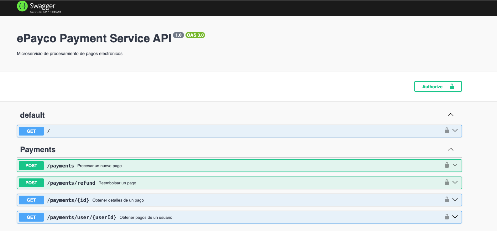

# Payment Service - ePayco

Microservicio para procesamiento de pagos electrónicos, desarrollado con NestJS y TypeScript siguiendo Clean Architecture.

## 🏗️ Estructura del Proyecto

Implementa **Clean Architecture** con separación clara de responsabilidades:

```
src/
├── domain/                     # Capa de Dominio (Entidades y Reglas de Negocio)
│   ├── entities/              # Entidades del dominio
│   │   ├── payment.entity.ts  # Entidad Payment (pagos)
│   │   └── transaction.entity.ts  # Entidad Transaction (transacciones)
│   ├── enums/                 # Enumeraciones del negocio
│   │   ├── payment-status.enum.ts    # Estados de pago
│   │   ├── payment-method.enum.ts    # Métodos de pago
│   │   └── transaction-type.enum.ts  # Tipos de transacción
│   └── repositories/          # Interfaces de repositorios
│       └── payment.repository.interface.ts
│
├── application/                # Capa de Aplicación (Casos de Uso)
│   ├── use-cases/             # Casos de uso del negocio
│   │   ├── process-payment.usecase.ts   # Procesar pago
│   │   ├── refund-payment.usecase.ts    # Reembolsar pago
│   │   └── get-payment.usecase.ts       # Consultar pago
│   └── services/              # Servicios de aplicación
│       └── saga-orchestrator.service.ts  # Orquestador SAGA
│
├── api/                        # Capa de Presentación (API REST)
│   └── payments/              # Módulo de pagos
│       ├── controllers/       # Controladores HTTP
│       │   └── payments.controller.ts
│       ├── dtos/              # Data Transfer Objects
│       │   ├── create-payment.dto.ts
│       │   ├── refund-payment.dto.ts
│       │   └── payment-response.dto.ts
│       └── payments.module.ts
│
├── infrastructure/             # Capa de Infraestructura
│   ├── config/               # Configuración de la aplicación
│   │   └── configuration.ts  # Variables de entorno
│   └── infrastructure.module.ts  # Módulo de infraestructura
│
└── main.ts                    # Punto de entrada de la aplicación
```

## 🚀 Tecnologías

- **Framework**: NestJS 10
- **Language**: TypeScript 5
- **Database**: PostgreSQL (compatible con Aurora)
- **ORM**: TypeORM
- **Validation**: class-validator + class-transformer
- **Documentation**: Swagger/OpenAPI
- **Authentication**: JWT
- **Architecture**: Clean Architecture + SAGA Pattern

## 📋 Prerequisitos

- Node.js 18+
- PostgreSQL 13+ (opcional para desarrollo)
- npm o yarn

## 🎯 Funcionalidades Implementadas

### 1. Procesamiento de Pagos
- **Use Case**: ProcessPaymentUseCase
- **Métodos soportados**: Tarjeta de crédito, PSE, Wallet, Nequi, Bancolombia
- **Validaciones**: Antifraude básica, validación de fondos
- **Idempotencia**: Protección contra duplicados vía `idempotencyKey`

### 2. Reembolsos
- **Use Case**: RefundPaymentUseCase
- **Validaciones**: Estado del pago, elegibilidad de reembolso
- **Proceso**: Reversa de transacción + actualización de estado

### 3. Consultas
- **Use Case**: GetPaymentUseCase
- **Filtros**: Por ID, por usuario, por estado
- **Respuesta**: Incluye transacciones relacionadas

### 4. SAGA Pattern
- **Servicio**: SagaOrchestratorService
- **Pasos**: Validación → Reserva → Antifraude → Procesamiento → Notificación
- **Compensación**: Rollback automático en caso de error
- **Consistencia**: Garantiza transacciones distribuidas

## 🛠️ Instalación

```bash
# Instalar dependencias
npm install

# Configurar variables de entorno
cp .env.example .env.development
# Editar .env.development con tus configuraciones
```

## ⚙️ Configuración

Variables de entorno en `.env.development`:

```env
# Tipo de Base de Datos
DATABASE_TYPE=sqlite    # 'sqlite' (por defecto) o 'postgres'

# Solo si usas PostgreSQL (DATABASE_TYPE=postgres)
DB_HOST=localhost
DB_PORT=5432
DB_USERNAME=postgres
DB_PASSWORD=tu-password
DB_DATABASE=epayco_payments

# JWT
JWT_SECRET=tu-secret-key
JWT_EXPIRATION=24h

# API
PORT=3001
NODE_ENV=development
```

### 🎯 Opción 1: SQLite (Recomendado para desarrollo)

**Por defecto** el proyecto usa SQLite - ¡sin instalación adicional necesaria!

```bash
# Ya configurado en .env.development
DATABASE_TYPE=sqlite

# Solo ejecuta:
npm run start:dev
```

El archivo `epayco_payments.sqlite` se creará automáticamente con las tablas.

### 🐘 Opción 2: PostgreSQL (Producción/AWS)

Para usar PostgreSQL (local o Aurora):

```env
# Cambiar en .env.development
DATABASE_TYPE=postgres
DATABASE_HOST=localhost
DATABASE_PORT=5432
DATABASE_USERNAME=postgres
DATABASE_PASSWORD=tu-password
DATABASE_NAME=epayco_payments
```

## 💾 Base de Datos

### Setup con SQLite (Por defecto - Cero configuración)

¡No necesitas instalar nada! El proyecto usa SQLite por defecto:

```bash
# Simplemente arranca el servidor
npm run start:dev

# TypeORM creará automáticamente:
# - epayco_payments.sqlite (archivo de base de datos)
# - Tablas: payments, transactions
# - Índices y constraints
```

El archivo SQLite se creará en la raíz del proyecto backend.

### Setup con PostgreSQL (Opcional - Para producción)

Si prefieres PostgreSQL:

```bash
# 1. Cambiar en .env.development
DATABASE_TYPE=postgres

# 2. Crear la base de datos
createdb epayco_payments

# 3. (Opcional) Ejecutar el schema manualmente
psql -d epayco_payments -f database/schema.sql

# 4. (Opcional) Cargar datos de prueba
psql -d epayco_payments -f database/seed.sql
```

**Nota**: Con `synchronize: true` en desarrollo, TypeORM crea las tablas automáticamente.

## 🏃 Comandos Disponibles

```bash
# Desarrollo (watch mode)
npm run start:dev

# Build para producción
npm run build

# Iniciar producción
npm run start:prod

# Linting
npm run lint

# Formateo
npm run format
```

## 📚 Documentación API

Una vez iniciado el servidor, Swagger estará disponible en:

```
http://localhost:3001/swagger
```



### Endpoints Principales

#### Pagos
- `POST /payments` - Crear nuevo pago
- `GET /payments/:id` - Consultar pago por ID
- `GET /payments/user/:userId` - Listar pagos de un usuario
- `POST /payments/refund` - Procesar reembolso

#### Ejemplo de Request

```bash
curl -X POST http://localhost:3001/payments \
  -H "Content-Type: application/json" \
  -d '{
    "userId": "123e4567-e89b-12d3-a456-426614174000",
    "amount": 50000,
    "currency": "COP",
    "method": "CREDIT_CARD",
    "idempotencyKey": "payment_20260114_abc123",
    "description": "Pago por servicio"
  }'
```

## 🏛️ Arquitectura

### Clean Architecture

El proyecto sigue los principios de Clean Architecture:

1. **Domain Layer** (Núcleo del negocio)
   - Entidades: Representan conceptos del negocio
   - Enums: Estados y tipos del dominio
   - Interfaces: Contratos para repositorios

2. **Application Layer** (Casos de uso)
   - Use Cases: Lógica de aplicación
   - Services: Orquestación de procesos complejos

3. **API Layer** (Presentación)
   - Controllers: Manejo de peticiones HTTP
   - DTOs: Validación y transformación de datos

4. **Infrastructure Layer** (Detalles técnicos)
   - TypeORM: Implementación de repositorios
   - Config: Configuración de la aplicación

### SAGA Pattern

Implementación del patrón SAGA para transacciones distribuidas:

- **Orchestrator**: `SagaOrchestratorService`
- **Steps**: Validación → Reserva → Antifraude → Proceso → Notificación
- **Compensation**: Rollback automático si falla algún paso
- **Idempotencia**: Garantiza que no se procesen pagos duplicados

## 🚀 Arquitectura AWS (Producción)

En producción este servicio está diseñado para:

- **Compute**: ECS Fargate (contenedores serverless)
- **Database**: Aurora PostgreSQL Serverless
- **Orchestration**: Step Functions (SAGA)
- **API Gateway**: Application Load Balancer
- **Monitoring**: CloudWatch + X-Ray

Ver `docs/documento-arquitectonico.md` para más detalles.

## 🔒 Seguridad

- Validación de datos con class-validator
- Idempotencia en operaciones críticas
- Preparado para integración con WAF
- Headers de seguridad configurados

## 📝 Próximos Pasos

- [ ] Integrar con gateway de pagos real
- [ ] Implementar sistema de notificaciones
- [ ] Añadir tests unitarios e integración
- [ ] Configurar CI/CD
- [ ] Implementar rate limiting
